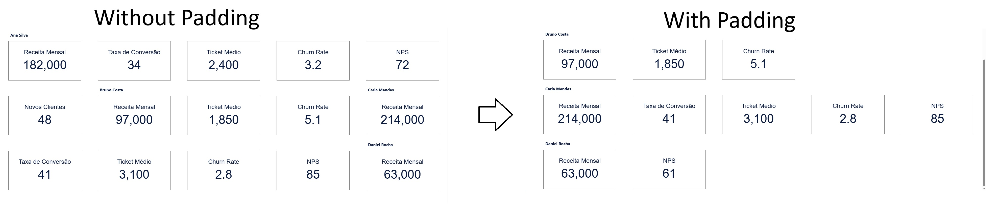

## Problem

While developing KPI cards in CRM Analytics using a repeater, I noticed that there was no built-in way to group cards by owner. The final layout displayed cards side by side, even when they belonged to different owners.

Visually, this becomes confusing and not very user-friendly. The user would need to inspect each card individually to understand where one owner’s data starts and ends.

This happens because the repeater does not provide native support for grouping. It simply distributes records sequentially, filling N cards per row without any separation logic.

---

## Solution

The solution I implemented was to handle this at the SAQL level. The idea is to calculate, for each owner, how many “invisible” records are needed to complete the last row, forcing the next owner’s data to start on a new row.

### Padding Formula

```sql
padding = (itemsPerRow - (cnt % itemsPerRow)) % itemsPerRows
```
Where:

- cnt = number of KPIs per owner
- itemsPerRow = number of cards per row in the repeater

These padding records are added using a union at the end of each owner’s real data. To prevent them from being visible, each card element in the repeater uses conditional formatting: when the field "TipoRegistro" is equal to "padding", all visual elements are made transparent (white background, white text, no borders).

This approach works for any number of owners, including cases where the number changes dynamically due to security predicates, because the padding is calculated at query runtime rather than in the layout.

---
Note: In the code, the Rank field was used to control ordering and to display the manager’s name only in the first card of each group.


